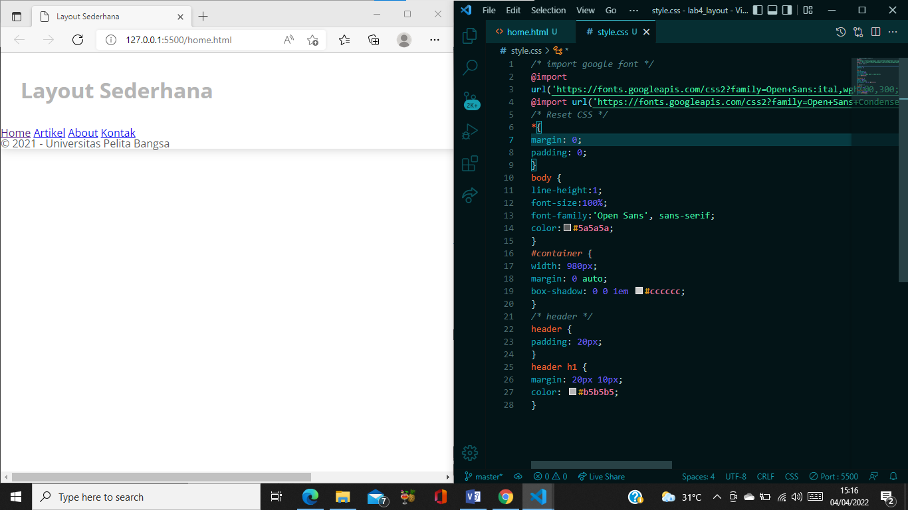

# Tugas Praktikum Lab4web

| Nova Tegar Adiyansyah | 312010145 |
| ------------------- | ------------|
| TI.20.A.1 | Pemrograman Web |

# Langkah-langkah Praktikum 4 

# 1. Membuat Box Element 

Tambahkan kode tag div seperti berikut :  

# 2. CSS Float Property 

Tambahkan deklarasi css. 

Kemudian buka browser untuk melihat hasilnya 

# 3. Mengatur Clearfix Element 

Clearfix digunakan untuk mengatur element setelah float element. Property clear digunakan untuk
mengaturnya. 
Tambahkan div4 seperti berikut : 

Kemudian atur property clear pada CSS, seperti berikut. 

Selanjutnya buka browser dan refresh kembali. 

# 4. Membuat Layout Sederhana 

Kita akan membuat layout web sederhana seperti gambar berikut.(tertera di pratikum4) 

Buat folder baru dengan nama lab4_layout, kemudian buatlah file baru didalamnya dengan nama
home.html, dan file css dengan nama style.css

tulis kode berikut.kemudian buka browsurnya dan lihat hasilnya 

Tambahkan kode css untuk membuat layoutnya 

# 5. Membuat Navigasi 

Kemudian selanjutnya mengatur navigasi.Lalu buka browser dan lihat hasilnya 

# 6. Membuat Hero Panel 

Selanjutnya membuat hero panel. Tambahkan kode HTML dan CSS seperti berikut. 

Kemuadian lihat hasilnya  

# 7. Mengatur Layout Main dan Sidebar 

Selanjutnya mengatur main content dan sidebar, tambahkan CSS float. 

# 8. Membuat Sidebar Widget 

Kemudian selanjutnya menambahkan element lain dalam sidebar. 

Tambahkan CSS  

Hasilnya 

# 9. Mengatur Footer 

Selanjutnya mengatur tampilan footer. Tambahkan CSS untuk footer. 

css nya  

# 10. Menambahkan Elemen lainnya pada Main Content 

Tambahkan CSS 

Hasilnya 

# 11. Menambahkan Content Artikel 

Selanjutnya membuat content artikel. Tambahkan HTML berikut pada main content. 

Tambahkan CSS  

Refresh browsur,dan lihat hasilnya 

## ========== TERIMAKASIH ========== ##

## Pertanyaan dan Tugas 

1. Tambahkan Layout untuk menu About
=> buat single layout yang berisi deskripsi, portfolio, dll 

2. Tambahkan layout untuk menu Contact
=> yang berisi form isian: nama, email, message, dll 